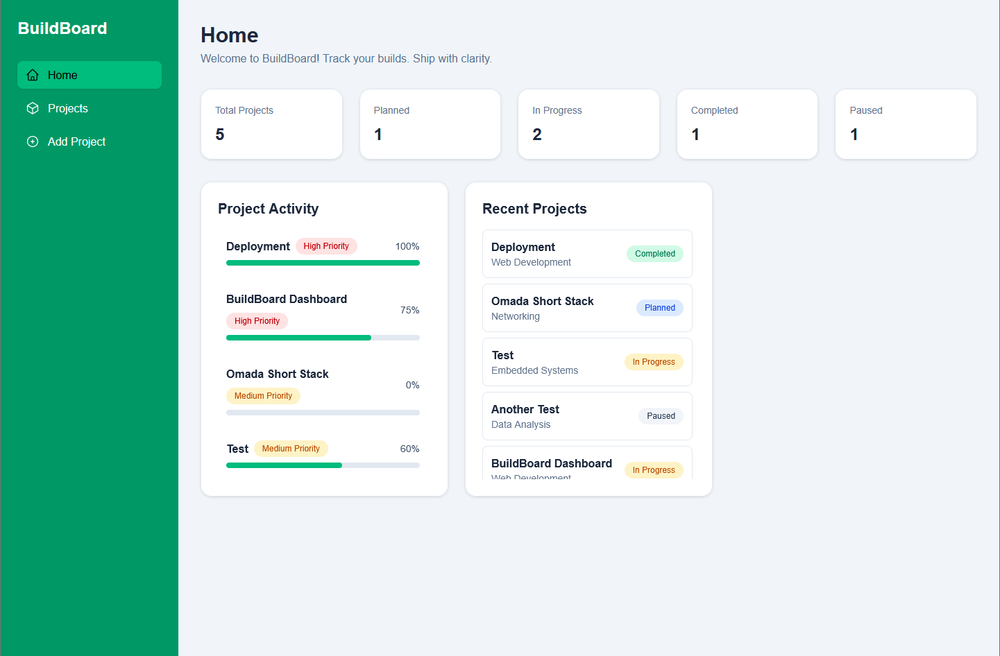
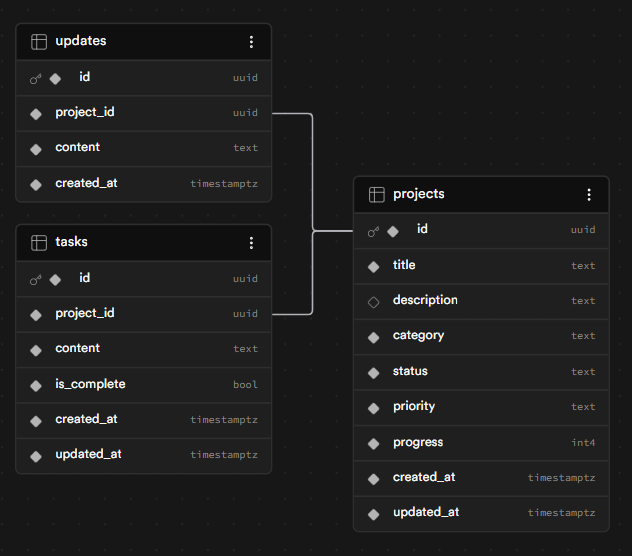
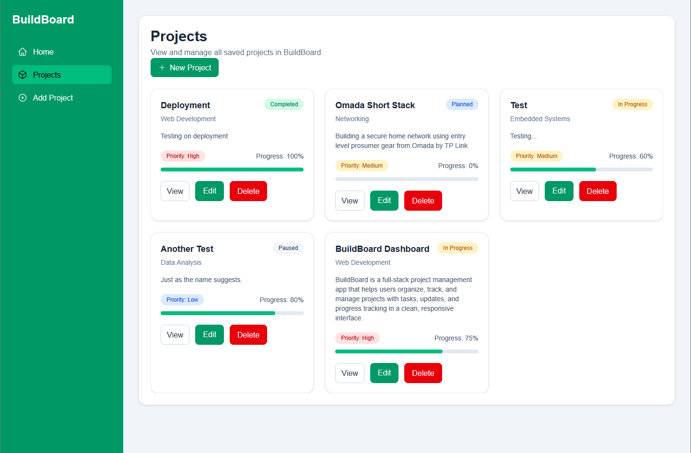
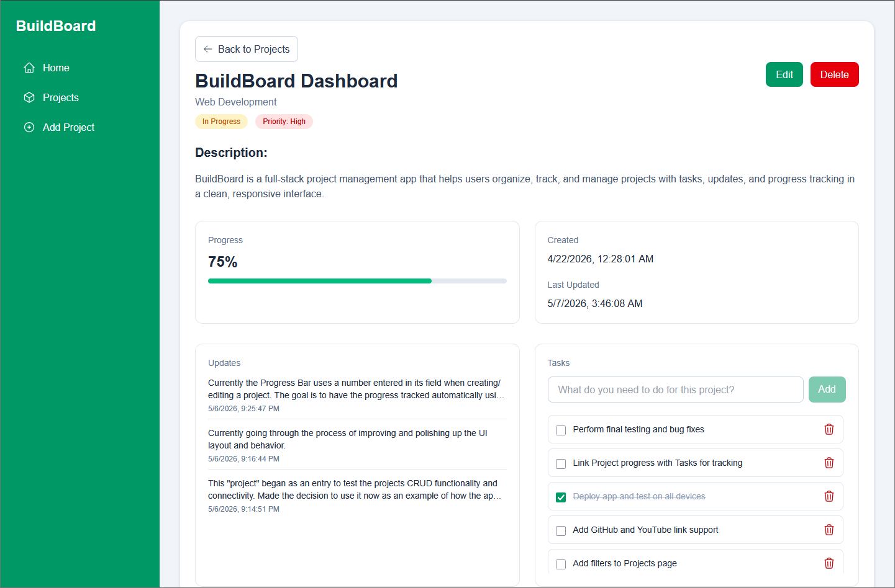
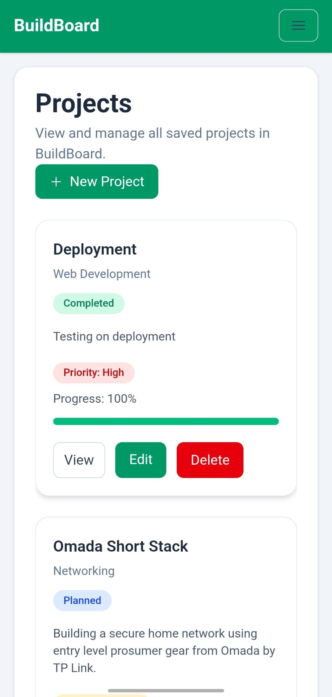

# BuildBoard



BuildBoard is a full-stack project management dashboard that helps users organize, track, and manage development projects in one place. It includes project CRUD functionality, task tracking, project updates, progress indicators, and a responsive dashboard interface.

## Live Demo

<https://buildboard-vert.vercel.app/>

## Features

- Create, view, edit, and delete projects
- View dashboard stats, recent projects, and project activity
- Track project status and priority with dynamic badges
- Track project progress with completion percentage and progress bar
- Add project updates through a modal interface
- Manage project tasks with add, complete, and delete functionality
- Responsive layout with desktop sidebar and mobile menu navigation
- Supabase/PostgreSQL database integration
- Next.js API routes for backend functionality

## Tech Stack

- **Frontend:** Next.js, React, Tailwind CSS
- **Backend:** Next.js API Routes
- **Database:** Supabase / PostgreSQL
- **Deployment:** Vercel
- **Icons:** Heroicons

## Project Structure

- `app/` - pages and API routes
- `components/` - reusable UI components
- `lib/` - shared utilities and styles

## Database Tables

- **projects** - stores project details, status, priority, and progress
- **updates** - stores project update entries
- **tasks** - stores project to-do items and completion status



## Installation & Setup

**1. Clone the Repository**

```bash
git clone https://github.com/PhilC21/buildboard.git
cd buildboard
```

**2. Install dependencies**

```bash
npm install
```

**3. Set up environment variables**

Create `.env.local` file in the root filling in with your actual values from Supabase:

```env
NEXT_PUBLIC_SUPABASE_URL=your_supabase_project_url
NEXT_PUBLIC_SUPABASE_PUBLISHABLE_KEY=your_supabase_publishable_key
SUPABASE_SECRET_KEY=your_supabase_secret_key
NEXT_PUBLIC_APP_URL=http://localhost:3000
```

*Note: For deployment, set `NEXT_PUBLIC_APP_URL` to your deployed (Vercel or otherwise) URL.*

**4. Run the development server**
```bash
npm run dev
```

Then open <http://localhost:3000> in your web browser.


## Reflection

BuildBoard was developed as a full-stack application using Next.js and Supabase, with the goal of creating a practical project management tool that feels clean and easy to use. I hadn't worked with Supabase before and I am still relatively new to Next.js, giving me a perfect opportunity to work with and gain some experience with both. I wanted to focus on both functionality and usability, making sure the interface stayed responsive while supporting full CRUD operations for projects, tasks, and updates.

I approached the development in stages. I started by setting up the database and API routes for the projects and building out the general layout and UI. Then, I transitioned to building out the core features, and finally spent time refining the UI and improving responsiveness across different screen sizes.

One of the more challenging parts was dealing with responsive layouts, especially preventing overflow issues on smaller screens. I also put effort into organizing reusable components and centralizing Tailwind styles, which made the codebase easier to manage as the project grew.

Overall, this project gave me a much better understanding of how a full-stack application comes together, from API design to database integration and frontend responsiveness. It also helped me think more carefully about structure, scalability, and user experience.

*Note: AI tools were used to assist with debugging, planning features, improving responsiveness, and drafting documentation. All suggestions were reviewed and adapted to fit the needs of the project.*

## Screenshots

### Home Page


### Projects Page



### Project Details


### Mobile View
